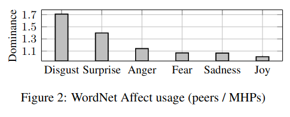
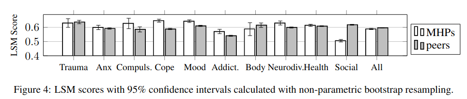

# Exploring Self-Identified Counseling Expertise in Online Support Forums

This repository contains data information and experimental code for our ACL 2021 Findings paper *[Exploring Self-Identified Counseling Expertise in Online Support Forums](https://aclanthology.org/2021.findings-acl.392.pdf).* 


## Data

- [task_data.csv](./Data/task_data.csv): contains the post ids, comment ids, subreddit names, and author type (mhp or non-mhp) of each data instance used in this study.
- [subreddit_topics.csv](./Data/subreddit_topics.csv): Contains the health topics for the subreddits. 
  
  To create these topics, we began with Sharma & Munmun (2018)'s subreddit categorization, which includes the categories *Trauma & Abuse,* *Psychosis & Anxiety,* *Compulsive Disorders,* *Coping & Therapy,* and *Mood Disorders.* Then, we used [World Health Organization's ICD-10 classification system of mental and behavioural disorders](https://www.who.int/substance_abuse/terminology/icd_10/en/) as a basis for categorizing the additional subreddits in our study, and to adjust and add to the original categories.


## Distinguishing MHPs and Peers

### Unigram Features
- [1-distinguishing-mhps-and-peers.ipynb](./Experiments/1-distinguishing-mhps-and-peers.ipynb): code for the experiments with unigram features.

### LIWC & LIWC Perspective features
* A license is required for LIWC (see http://liwc.wpengine.com/) so we haven't posted our code, however, we have published the results_df's and fold_vector_df's if you would like to compare a replication to our results. 
  * results with all LIWC classes: [liwc.results_df.pickle](./Experiments/clf-results/liwc.results_df.pickle) & [liwc.fold_vector_df.pickle](./Experiments/clf-results/liwc.fold_vector_df.pickle)
  * results with perspective LIWC classes: [perspective.results_df.pickle](./Experiments/clf-results/perspective.results_df.pickle) & [perspective.fold_vector_df.pickle](./Experiments/clf-results/perspective.fold_vector_df.pickle)
* The experimental setup is the same as for unigram features, however instead of counting unigrams, we count the LIWC classes of each unigram.
* The classes used for the perspective features are the following:
  ```python
  liwc_perspective_classes = ['FOCUSFUTURE', 'FOCUSPAST', 'FOCUSPRESENT', 'I', 'IPRON', 'NEGEMO', 'POSEMO', 'PPRON', 'PRONOUN', 'SHEHE', 'THEY', 'WE', 'YOU']
  ```

## Linguistic and Dialogue Analysis

[LIWC.ipynb](./Analyses/LIWC.ipynb): Code for plotting Figure 1, LIWC usage. We provide the precomputed dominance scores for making the plots, since a license is required for LIWC (see http://liwc.wpengine.com/).

  


[Wordnet-Affect.ipynb](./Analyses/Wordnet-Affect.ipynb): Code for plotting Figure 2, WordNet affect usage. We provide the precomputed dominance scores for making the plots. To obtain WordNet domains, please see here: [https://wndomains.fbk.eu/download.html](https://wndomains.fbk.eu/download.html).

  


[Prompts-Support-Seeker.ipynb](./Analyses/Prompts-Support-Seeker.ipynb): Code for plotting Figure 3, LIWC categories based on posts that prompt support-seeker replies. We provide percent usage of each LIWC category for each grouping, since a license is required for LIWC (see http://liwc.wpengine.com/).

  


[LSM.ipynb](./Analyses/LSM.ipynb): Code for plotting Figure 4, linguistic style matching. We provide the precomputed LSM scores for the function word categories for each post-reply pair, since a license is required for LIWC (see http://liwc.wpengine.com/).

  


## Language Modeling

See the README in the `language_model` folder.


----


### Citation

Please cite the following paper if you find this resource useful in your research:

```bibtex
@inproceedings{lahnala-etal-2021-exploring,
    title = "Exploring Self-Identified Counseling Expertise in Online Support Forums",
    author = "Lahnala, Allison and Zhao, Yuntian and, Welch, Charles and Kummerfeld, Jonathan K. and An, Lawrence C and Resnicow, Kenneth and Mihalcea, Rada and P{\'e}rez-Rosas, Ver{\'o}nica",
    booktitle = "Findings of the Association for Computational Linguistics: ACL-IJCNLP 2021",
    month = aug,
    year = "2021",
    address = "Online",
    publisher = "Association for Computational Linguistics",
    url = "https://aclanthology.org/2021.findings-acl.392",
    doi = "10.18653/v1/2021.findings-acl.392",
    pages = "4467--4480",
}
```

### References

*Eva Sharma and Munmun De Choudhury. 2018. [Mental health support and its relationship to linguistic accommodation in online communities](https://dl.acm.org/doi/10.1145/3173574.3174215). In *Proceedings of the 2018 CHI Conference on Human Factors in Computing Systems*, CHI ’18, page 1–13, New York, NY, USA. Association for Computing Machinery.